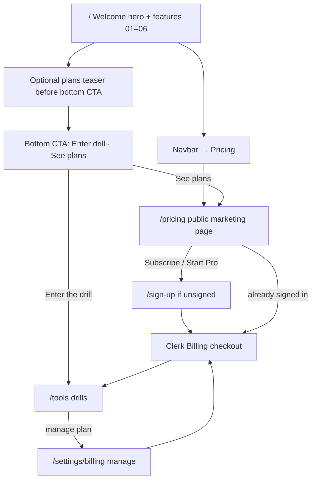

# Subscription / Pricing Page — Plan

> **Status: proposed.** Research + information architecture only. No billing
> code ships in this doc. For current product surface see `README.md`,
> `DESIGN-PRINCIPLES.md`, and the welcome layout under `components/welcome/`.

## Goal

Add a marketing-facing **subscription page** where visitors can understand
plans, compare Free vs paid access, and start checkout — without breaking the
welcome hero’s composition rules or the token-driven theme system.

## Product context (today)

| Fact | Implication for pricing |
|------|-------------------------|
| Auth is Clerk; Convex holds user data | Prefer **Clerk Billing (B2C)** over a second Stripe Billing stack |
| Welcome `/` and Pattern Lab are public; tools/articles/chat are gated | Pricing must be **public** so unsigned visitors can evaluate before signing up |
| Hero is a full-viewport math atmosphere + sparse copy | Pricing must **not** live in the first viewport |
| Navbar = marketing; `/tools/*` + `/settings/*` = dashboard shell | Pricing is a **marketing** page (`Navbar`), not a `DrillShell` tool |
| Navbar CTA is “Try it free” (sign-up) | Paid conversion should sit **downstream** of value explanation, not replace trial |

There is no pricing/billing surface yet (`PricingTable`, Stripe, or plan
entitlements). Chat is currently owner-allowlisted, not a general paid feature.

---

## UX research summary

Sources: 2026 SaaS pricing UX patterns (decision architecture, CRO), music-learning
app paywalls (Musora, Practito, Piano Marvel, Simply Piano), and Clerk Billing
guidance (dedicated pricing page + `PricingTable`).

### What converts

1. **Answer three questions in ~5 seconds:** who is this for, what does it cost,
   what do I get.
2. **2–3 plans max.** More tiers → decision paralysis. For a solo piano practice
   app, **Free + Pro** (optional annual vs monthly on Pro) beats a three-column
   “Starter / Pro / Enterprise” spreadsheet.
3. **One recommended plan.** Badge + stronger border/CTA on the paid (or
   annual) option; earn the recommendation with a clear “for whom” line.
4. **Monthly ↔ annual toggle.** Default monthly; surface annual savings when
   toggled (“Save X%”) so annual feels like a discount, not the baseline.
5. **Risk reversal next to the CTA**, not in the footer: cancel anytime, what
   happens after trial, no surprise charges.
6. **Progressive disclosure.** 4–6 decision features on the cards; deeper
   comparison or FAQ below. Avoid 20-row tables above the fold.
7. **Dedicated page.** Clerk recommends a standalone pricing route. Embedding a
   full checkout UI in the welcome scroll fights the existing narrative arc.
8. **Match CTA to buying motion.** Self-serve B2C → “Start Pro” / “Subscribe”,
   not “Talk to sales”. Unsigned users hit sign-up, then checkout.

### Music-app patterns that fit this product

| Pattern | Fit for Piano Suite |
|---------|---------------------|
| **Freemium** (limited free forever) | Strong — Pattern Lab + a taste of drills already teach value without a hard wall |
| **Trial → hard paywall** (Musora-style) | Weak for v1 — the app’s identity is “blocked practice / Anki verified,” not content library FOMO |
| **Annual anchoring** | Strong — use monthly vs annual on the paid plan, highlight annual |
| Soft paywall after value | Strong — welcome page educates first; pricing is the decision step |

### Anti-patterns to avoid here

- Pricing cards, badges, or plan chips **inside the hero** (violates
  `DESIGN-PRINCIPLES.md` §8 hero budget and the frontend design rules).
- Dashboard-style sidebar on the pricing route (wrong shell).
- Six identical “Buy now” buttons with no recommended plan.
- Hard-coded hex / purple-on-white SaaS clichés — use theme tokens only.
- Gating Pattern Lab or the public welcome atmosphere behind pay (kills the
  brand demo).

---

## Placement map (relative to the welcome page)

### Current welcome vertical structure

```
┌ sticky Navbar ──────────────────────────────────────────┐
│  Brand · Tools · Articles · Chat · [Sign in | Try free] │
└─────────────────────────────────────────────────────────┘
┌ Hero (min-h-svh) ───────────────────────────────────────┐
│  eyebrow · headline · one sentence · “Enter the drill”  │
│  (full-bleed atmosphere behind; hero-scrim pocket)      │
└─────────────────────────────────────────────────────────┘
  01 memory science
  02 Anki / FSRS
  03 motor memory
  04 Anki ↔ MIDI loop (FlowSection)
  05 jazz practice tradition
  06 companion decks (downloads)
┌ Bottom CTA ─────────────────────────────────────────────┐
│  “Enter the drill” + Anki/MIDI prerequisite             │
└─────────────────────────────────────────────────────────┘
  Footer
```

### Recommended placement (do / don’t)

| Surface | Action | Why |
|---------|--------|-----|
| **Hero first viewport** | **Do not** add pricing | Hero budget is brand + one CTA. Pricing here reads as a second product |
| **Navbar** | Add **Pricing** link | Expected discovery path; keeps Tools/Articles/Chat intact |
| **After feature 06, before bottom CTA** | Optional thin **“Plans” teaser** (one headline + one sentence + link to `/pricing`) | Value story is complete; buyer is ready to decide without leaving the scroll entirely |
| **Bottom `CtaSection`** | Keep primary “Enter the drill”; add secondary text link **See plans** | Dual path: practice now vs evaluate paid |
| **Dedicated `/pricing`** | **Primary subscribe surface** | Clerk + CRO consensus; room for toggle, FAQ, risk reversal |
| **`/settings/billing` (signed-in)** | Manage / cancel / change plan | Account ownership, not marketing |
| **Tools sidebar** | Soft “Upgrade” only when a gated action fails | Contextual, not a second marketing page |

### Information architecture diagram



### Route & shell decisions

| Route | Public? | Shell | Role |
|-------|---------|-------|------|
| `/pricing` | **Yes** (add to `proxy.ts` public list) | `Navbar` + marketing main (same atmosphere language as `/`) | Browse plans + start checkout |
| `/subscribe` | Optional alias → redirect to `/pricing` | — | Friendly URL if desired |
| `/settings/billing` | No (auth required) | Dashboard shell like theme/atmosphere | Manage subscription |
| Welcome inline teaser | On `/` | Existing welcome composition | Soft funnel only |

---

## Proposed `/pricing` page composition

One job per section. Cards are allowed here because they are the **interaction
container** for choosing a plan.

1. **Compact page hero** (not `min-h-svh`)
   - Fraunces heading: who it’s for (solo pianists drilling with Anki + MIDI)
   - One supporting sentence
   - No plan grid in this block if it crowds mobile; otherwise headline + toggle
     can share the first screen

2. **Billing period toggle** — Monthly / Annual (show savings on Annual)

3. **Plan cards (2)**
   - **Free** — Pattern Lab, limited practice taste, local-only or account with
     capped persistence (exact entitlements TBD in implementation phase)
   - **Pro** (recommended) — full drills, Convex sync / tracking, theme +
     atmosphere sync, future paid features
   - Each card: for-whom line, price, 4–6 bullets, CTA, risk line under CTA

4. **Trust / risk strip** adjacent to cards  
   Cancel anytime · Works with your Anki deck · MIDI keyboard required for drills

5. **Short comparison** (optional, collapsed on mobile) — only features that
   differ between Free and Pro

6. **FAQ (5–8)** — cancel, trial vs free forever, AnkiConnect still required?,
   what if I only want Pattern Lab?, student/educator?, refunds (Clerk Billing
   limitations), currencies (USD today)

7. **Secondary CTA** — back to Tools or “Enter the drill”

Footer can reuse the welcome footer line or a slim variant.

### Styling constraints (must follow)

- Tokens only: `bg-card`, `text-primary`, `border-border`, `ring-primary`, etc.
- Typography: Fraunces for page/plan titles; Inter for body; Geist Mono only for
  prices/timers if it matches existing stat treatment
- Surfaces: `rounded-xl` / `rounded-2xl` cards with `border border-border` /
  `ring-1 ring-foreground/10` — same language as `FeatureSection` cards
- CTAs: `rounded-full` primary pills (matches hero / navbar)
- Atmosphere: prefer the same fixed ambient background + light scrim as welcome
  so `/pricing` feels like the same instrument, not a white SaaS insert
- Do **not** invent a purple gradient or cream-serif look; stay on the warm dark
  studio palette from `DESIGN-PRINCIPLES.md`

### Clerk UI theming note

`PricingTable` is the fastest path to checkout. If the default Clerk chrome
fights the theme, wrap it in a token-styled shell first; if still off-brand,
use custom plan cards that call Clerk’s checkout APIs / components while keeping
plan definitions in the Clerk Dashboard.

---

## Pricing model recommendation (research)

### What this product actually is

Piano Suite is **not** a mass-market lesson library (Simply Piano / Musora). It is a
**niche utility** for pianists who already have Anki + a MIDI keyboard:

| Trait | Implication for pricing |
|-------|-------------------------|
| Small, educated audience (jazz / theory drillers) | Freemium needs *huge* volume to work on conversion % alone — you won’t get Simply Piano scale |
| High setup friction (AnkiConnect + MIDI) | Hard trial cutoffs punish users still wiring hardware |
| Core loop is client-side Web MIDI | Marginal cost of a free practicer is low until they sync |
| Sticky value is **history / PBs / streaks across devices** | Natural paid wedge already exists as `canPersist` vs local |
| No song/content FOMO | Musora-style hard paywall is the wrong psychology |
| Solo tool, weak network effects | Pure freemium-for-virality doesn’t apply |
| Chat is owner-allowlisted + LLM-costly | Do **not** hang v1 Pro on Chat |

### Models considered

| Model | Fit | Why |
|-------|-----|-----|
| **Hard free trial → paywall** (Musora) | Poor | Content-library FOMO; kills habit during Anki/MIDI setup |
| **Pure paid / no free** | Poor | Hardware + Anki already filter hard; adding pay before “aha” shrinks funnel to near zero |
| **Classic freemium** (Free forever limited + Pro) | **Good** | Matches architecture; Piano Marvel pattern; keeps non-payers practicing |
| **Opt-in free trial of Pro only** | Mediocre alone | Higher trial→paid %, but after expiry users leave forever — bad for a habit tool |
| **Reverse trial → Free forever** | **Best hybrid** | Full Pro for 7–14 days on signup, then land on Free; users *felt* sync before upgrade |
| **One-time / lifetime** | Weak as primary | Fits musician “buy a tool” instinct, but Convex + future AI are ongoing costs; Clerk Billing is subscription-first. Offer later as promo, not v1 spine |
| **Usage / seat / org billing** | Poor for v1 | Solo B2C product |

### Verdict

**Ship: Freemium (Free forever + Pro subscription), optionally with a 7–14 day reverse trial of Pro on first signup.**

Why this beats alternatives for *this* app:

1. **The paid product is sync + continuity**, not “more songs.” That maps cleanly to Free = local practice, Pro = Convex history / cross-device / full tracking — the split the codebase already has (`canAccess` vs `canPersist`).
2. **Niche + setup friction** means you must leave a durable free path after any trial, or you churn people mid-onboarding. Reverse trial → Free forever does that; a hard wall does not.
3. **Market analogs:** Piano Marvel uses freemium (useful free tier, pay for depth). Anki itself monetizes **sync** (AnkiWeb), not flashcards — the closest conceptual cousin to Piano Suite’s Pro wedge.
4. **Economics:** Client-side drills are cheap; you pay Convex mainly when users persist. Gate *persistence and multi-device continuity*, not the ability to play a chord once.
5. **Price positioning:** Charge like a **practice utility**, not a curriculum app. Simply Piano / Musora sit ~$15–30/mo for libraries. Indie sync tools sit lower. Target band for Pro: about **$5–10/mo or ~$40–80/yr** (exact numbers TBD) — enough to matter, not “another Simply Piano.”

### What Free vs Pro should mean (decisive packaging)

Prefer **full local drills on Free** over “one mode only.” Limiting drill *modes* before the user finishes MIDI/Anki setup creates false “broken app” signals. Limit what they **keep**.

| Capability | Free (forever) | Pro |
|------------|----------------|-----|
| Welcome + Pattern Lab | ✓ | ✓ |
| Companion Anki deck downloads | ✓ | ✓ |
| All core drills (chord, arpeggios, progression, root cycling, technique) | ✓ **local-only** | ✓ |
| Tracking / PBs / miss history | Browser-local or session | **Synced** (Convex) |
| Theme + atmosphere prefs | localStorage | **Synced** |
| Cross-device restore | ✗ | ✓ |
| Articles | Prefer **public or Free** (marketing) | ✓ |
| AI Chat | Stay owner-only until productized | Not a v1 Pro pillar |

Upgrade moment copy: *“Your reps are staying on this browser. Unlock Pro to keep personal bests and history across devices.”* — not *“Buy more drills.”*

### Optional Phase 1.5 — reverse trial

On first account creation, grant Pro features for **14 days** (no card required). When it ends, silently continue as Free (local drills still work). Prompt upgrade only when they hit a sync-worthy action (view Tracking across sessions, new device, export/import). This is the 2026 “reverse trial” pattern adapted to a habit product.

### Explicit non-recommendations

- Do **not** use a Musora-style hard paywall before any practice.
- Do **not** make Pattern Lab or the welcome atmosphere paid (they are the demo).
- Do **not** sell Chat as Pro until the allowlist and cost model change.
- Do **not** lead with lifetime pricing until subscription retention is proven.

Prefer **value-based** bullets (“Sync practice history across devices”) over
feature dumps (“Access Convex `practiceEvents`”).

---

## Codebase readiness — what already fits

The Free-local / Pro-sync model is **mostly pre-plumbed**. Today
`canPersist === isSignedIn`. Remapping that flag to Pro is the shortest path.

### Already aligned (reuse)

| Piece | Path | Why it helps |
|-------|------|--------------|
| Access vs persist split | `hooks/useAuthAccess.ts` | Drills already no-op Convex when `canPersist` is false |
| Drill engines take `enabled` | `useChordDrill`, `useArpeggios`, `useProgression`, `useRootCycling` | Pass `canPersist` straight through |
| Technique / tracking UI | `technique-tracker.tsx`, `*-panel.tsx` | Skip queries + hide import when `!canPersist` |
| Safe Convex queries | `convex/lib/auth.ts` `optionalUserId` | Return `null`/`[]` — won’t blank the app |
| Mutations upsert user | `ensureUserId` | Natural place to add Pro checks after identity |
| Public demo | `/`, `/tools/chladni` | Keep as Free acquisition surface |
| User bootstrap | `ensure-signed-in-user.tsx` | Can stay; Free accounts still need a `users` row if signed in |

### Gaps vs the recommended model

| Gap | Today | Needed |
|-----|-------|--------|
| Persist = Pro | `canPersist = isSignedIn` | `canPersist = hasPro` (or reverse-trial) |
| Unsigned drills | `proxy.ts` blocks `/tools/*` (except Chladni) | Public (or Free-account) drill routes |
| Theme/atmosphere sync | Any signed-in user syncs | Gate Convex on Pro if Free prefs stay local |
| Free local history | Session-only when `!canPersist` | Optional localStorage so Tracking isn’t empty |
| Server trust | Any Clerk JWT can write tracking | Reject non-Pro mutations |
| Billing UI | None | `/pricing` + Clerk Billing |
| Hobby bypass | `AUTH_DISABLED` opens everything | Must not be the Free product path |

---

## What you can do — ordered work packages

Do these in order. Each package is independently shippable; WP0–WP2 unlock the
model without charging anyone yet.

### WP0 — Product / Clerk Dashboard (no code)

1. Create Clerk Billing **B2C** plans: `free` (or default) + `pro` (monthly + annual).
2. Attach a feature slug e.g. `sync` / `pro_access` used by `has()`.
3. Pick prices in the ~$5–10/mo band; enable test mode.
4. Decide: freemium-only v1, or freemium + 14-day reverse trial.
5. **Before real paywalls:** custom domain + Clerk production keys; unset
   `NEXT_PUBLIC_AUTH_DISABLED` on Production (see README cutover checklist).
   Hobby non-commercial terms also matter before charging.

### WP1 — Entitlement primitive (small code, high leverage)

Remap the existing gate — do **not** invent a parallel system.

```
hooks/useAuthAccess.ts
  canAccess  → true for drills you want Free (signed-in Free, and later unsigned)
  canPersist → true only when Pro (or AUTH_DISABLED for local Hobby)

lib/billing.ts          ← plan/feature helpers, slug constants
hooks/usePlanAccess.ts  ← thin wrapper around Clerk has() if preferred
```

- When `AUTH_DISABLED=true`, treat as Pro locally so cloud agents / Hobby preview
  keep working.
- Unit-test the pure helpers (`lib/__tests__/billing.test.ts`).
- Soft copy: replace “Sign in to save” with “Upgrade to Pro to sync…” where
  `isSignedIn && !canPersist`.

Touch: `useAuthAccess.ts`, drill page banners, `technique-tracker.tsx`,
tracking page banner, `README.md` auth table.

### WP2 — Server-side Pro enforcement (required before charging)

Client gates are not enough — a Free signed-in user can still call mutations.

- In `convex/tracking.ts` and `convex/technique.ts` (and optionally
  `convex/settings.ts`): after `ensureUserId`, verify Pro entitlement.
- Prefer verifying via Clerk JWT template claims / `ctx.auth.getUserIdentity()`
  public metadata or Clerk’s documented Billing claim shape — avoid trusting
  only the client.
- Queries stay soft: Free users get `[]` / `null`.
- Add `convex-test` cases: signed-in Free cannot insert; Pro can.

### WP3 — Open Free practice routes

Once WP1 is plan-aware:

- Expand `proxy.ts` public list: `/pricing`, drill routes you want try-before-account
  (or keep account-required Free, public only `/pricing` + Pattern Lab — simpler).
- **Recommended simpler v1:** keep drills behind sign-in (Free account), make
  `/pricing` (+ maybe `/articles`) public. Unsigned “local drills” can wait.
- Update `e2e/auth-protection.spec.ts` + README public-route table.

### WP4 — Billing / marketing surface

Can parallel WP1 once Dashboard plans exist:

| Deliverable | Path |
|-------------|------|
| Pricing page | `app/pricing/page.tsx` + `components/pricing/*` |
| Manage billing | `app/settings/billing/page.tsx` |
| Nav link | `components/navbar.tsx` |
| Welcome secondary CTA | `cta-section.tsx` / optional teaser |
| Public `/pricing` | `proxy.ts` |

Use Clerk `<PricingTable />` first; theme-wrap later if chrome clashes.

### WP5 — Free local continuity (makes the upgrade moment real)

Today `!canPersist` = **session-only** (lost on refresh). For the Pro pitch
(“keep your PBs”), Free needs durable browser history:

- localStorage (or IndexedDB) writers beside the Convex `enabled` branch in
  drill hooks / technique.
- Tracking panels read local when Free, Convex when Pro.
- Upgrade path: one-shot “Upload local history to Pro” (extend patterns from
  `import-local-storage.tsx` / `bulkImportTracking`).

### WP6 — Align settings sync with Free/Pro (optional polish)

Theme / atmosphere hooks currently sync on any `isSignedIn`
(`useThemePreference`, `useAmbientEffects`, hero settings). Flip Convex sync
to `canPersist` if Free prefs must stay device-local per the packaging table.

### Explicitly defer

- Chat as a Pro feature (owner allowlist + LLM cost).
- Hard-paywall Pattern Lab / welcome.
- Schema `plan` fields unless Clerk claims aren’t enough.
- Lifetime SKU until subscription retention is known.

---

## Suggested first week of coding (minimal path)

If you want the smallest useful slice that points in this direction:

1. **WP0** — create Pro plan in Clerk Dashboard (test mode).
2. **WP1** — `canPersist = hasPro || authDisabled` (signed-in Free = local drills).
3. **WP4** — public `/pricing` with `PricingTable` + navbar link (even if checkout
   is test-only).
4. Soft upgrade banners on Tracking / Technique when Free.
5. **WP2** before taking real payments.

Skip unsigned drills and localStorage history until after that slice works.

---

## Implementation phases (updated)

### Phase 0 — Decisions

- [x] UX research + placement map
- [x] Pricing model: freemium + optional reverse trial
- [x] Codebase leverage mapped (`canPersist` remap)
- [ ] Owner confirms prices + reverse trial yes/no
- [ ] Clerk Billing Dashboard plans created
- [ ] Auth cutover path (custom domain / unset `AUTH_DISABLED`) planned

### Phase 1 — Gate remap + pricing page (no hard server reject yet)

- WP1 + WP4
- Soft upgrade UI only

### Phase 2 — Enforce + harden

- WP2 server checks, e2e, optional WP3 public articles
- Remove reliance on `AUTH_DISABLED` for “Free”

### Phase 3 — Continuity + polish

- WP5 local history + Free→Pro import
- WP6 settings sync alignment
- Reverse trial if chosen
- Clerk appearance / FAQ polish

---

## Technical architecture (when implementing)

### Billing provider

**Clerk Billing for B2C** — already on `@clerk/nextjs` (`^7.6.1`), Stripe under
the hood for payments, Plans/Features configured in Clerk Dashboard. Annual
plans supported. Known limits to surface in FAQ/copy: USD-only today, no
built-in VAT, refunds via Stripe not reflected in Clerk MRR, no 3DS (relevant
for some EU renewals).

### File layout (proposed)

| Concern | Path |
|---------|------|
| Public pricing page | `app/pricing/page.tsx` |
| Page sections | `components/pricing/*` |
| Welcome teaser | `components/welcome/pricing-teaser.tsx` (optional) |
| Manage billing | `app/settings/billing/page.tsx` |
| Entitlement helpers | `lib/billing.ts` (+ optional `hooks/usePlanAccess.ts`) |
| Remap persist gate | `hooks/useAuthAccess.ts` |
| Server checks | `convex/tracking.ts`, `convex/technique.ts`, maybe `settings.ts` |
| Public route | `proxy.ts` — add `/pricing` |
| Nav | `components/navbar.tsx` |
| Docs / tests | README, this plan, unit + e2e |

### Hotspots (single-writer awareness)

- `proxy.ts`, `components/navbar.tsx`, welcome CTA files
- `hooks/useAuthAccess.ts` (central — coordinate)
- Theme/atmosphere hooks if WP6
- Possibly `package.json` only if Billing needs extra packages
- Avoid `convex/schema.ts` unless storing plan cache

### Auth & entitlement flow

1. `/pricing` public — browse without login.
2. Subscribe CTA → if signed out, sign-up → checkout.
3. `canPersist` true only for Pro (or reverse-trial / `AUTH_DISABLED`).
4. Server mutations reject non-Pro; queries stay soft.
5. Queries never throw from root providers when plan is missing.

### Out of scope (v1)

- B2B / Organizations billing
- Custom enterprise quotes / Tax/VAT UI
- Raw Stripe Billing instead of Clerk
- Hard-paywalling welcome / Pattern Lab
- Chat as Pro pillar

---

## Success criteria

- First welcome viewport unchanged in spirit.
- Visitors reach `/pricing` from navbar + welcome secondary path.
- Signed-in Free users can drill; Convex tracking writes only for Pro.
- Soft upgrade copy on Tracking when Free (not a hard crash).
- All colors from theme tokens.
- Real paywall only after Clerk production + `AUTH_DISABLED` off.

## Open questions for the owner

1. Exact monthly/annual Pro prices within the ~$5–10/mo / ~$40–80/yr band?
2. Ship reverse trial (14 days Pro → Free) in v1, or freemium-only first?
3. Should Articles become public marketing, or stay auth-gated?
4. Confirm Chat stays owner-only (recommended for v1).
5. Clerk Billing appearance: stock `PricingTable` first, or custom cards from day one?
6. v1 Free = signed-in local only, or also unsigned public drills?
